# Praven Pro - System Diagrams

This document contains all system architecture and process flow diagrams using Mermaid notation for GitHub rendering.

---

## 1. Overall Validation Pipeline

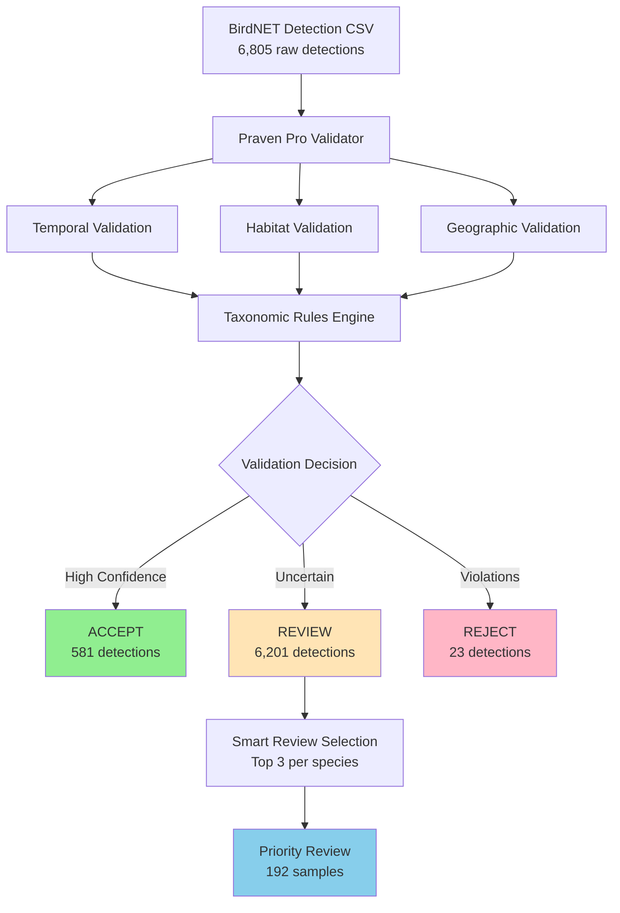

---

## 2. Temporal Validation Logic

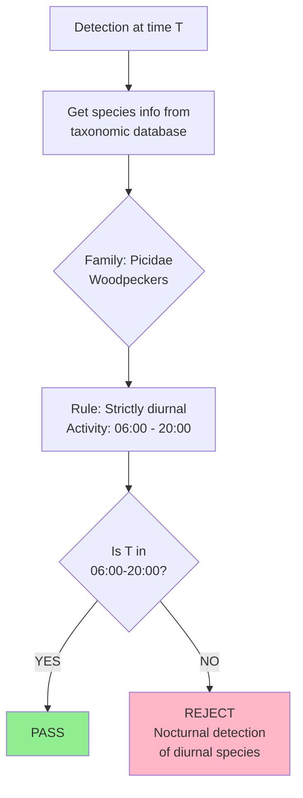

---

## 3. Habitat Validation Logic

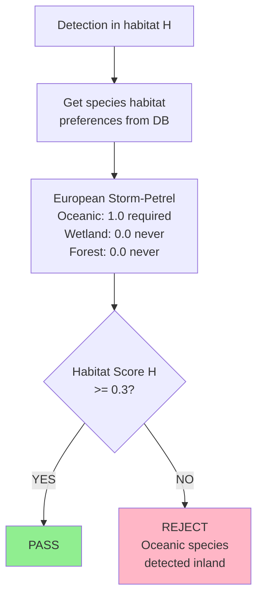

---

## 4. Smart Review Selection Process

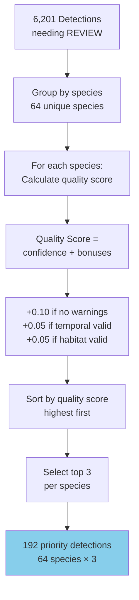

---

## 5. Review Workflow

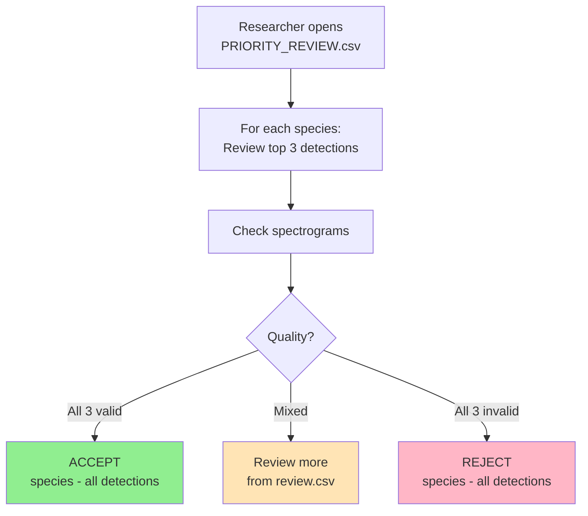

---

## 6. Data Flow

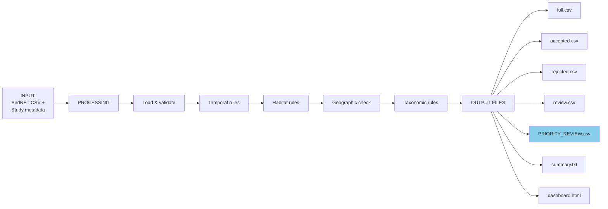

---

## 7. eBird Data Management

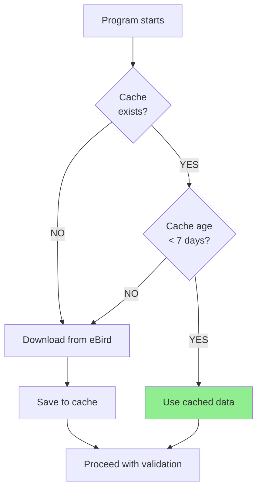

---

## 8. System Architecture

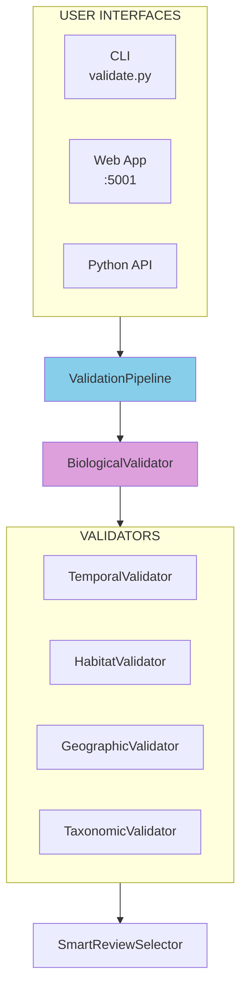

---

## 9. Taxonomic Rule Application

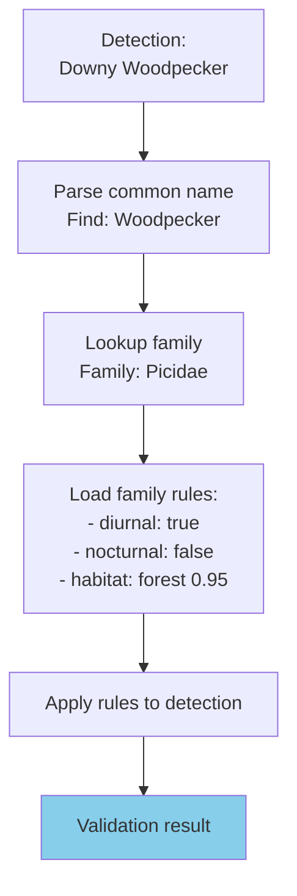

---

## 10. Quality Score Calculation

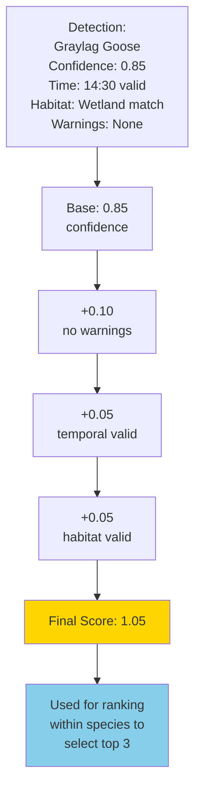

---

## 11. Complete Workflow Integration

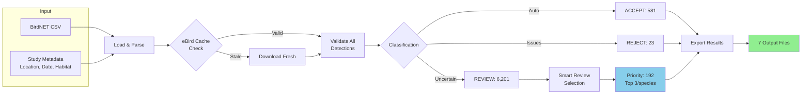

---

## Diagram Legend

**Colors:**
- 🟢 Green: Accepted/Valid results
- 🔴 Pink: Rejected/Invalid results
- 🟡 Tan: Review required
- 🔵 Blue: Priority/Important outputs
- 🟣 Purple: Core processing components
- 🟠 Gold: Calculated metrics

**Node Shapes:**
- Rectangle: Process/Action
- Diamond: Decision point
- Rounded: Input/Output
- Cylinder: Data storage
