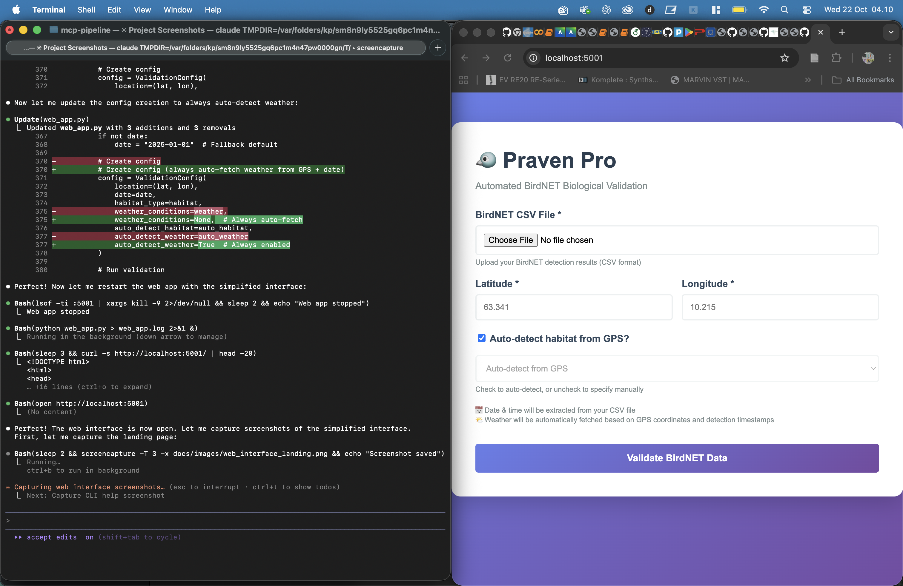

# Praven Pro - Screenshots & Demonstration

## Web Interface (Simplified)

### Landing Page



The web interface has been simplified to only require:
- **BirdNET CSV File Upload**
- **GPS Coordinates** (Latitude/Longitude)
- **Optional Habitat Override** (checkbox for auto-detection)

**Automatic Features:**
- 📅 **Date & Time**: Extracted automatically from CSV columns (`recording_date`, `absolute_timestamp`, or `filename`)
- 🌤️ **Weather Data**: Auto-fetched from Open-Meteo API using GPS coordinates + extracted dates
- 🌍 **Habitat Type**: Auto-detected from OpenStreetMap using GPS coordinates (or manual override)

---

## CLI Usage

### Auto-Detection Example

```bash
$ python validate.py validation/gaulossen_all_detections.csv \
    --lat 63.341 --lon 10.215
```

**Output:**
```
================================================================================
Praven Pro 2.0 - BirdNET Biological Validation
================================================================================

Configuration:
  Input:    validation/gaulossen_all_detections.csv
  Location: (63.341, 10.215)
  Habitat:  None
  Date:     2025-10-15

🌍 Auto-detecting habitat from GPS coordinates...
   Detected: grassland (39%), oceanic (23%), wetland (16%), urban (13%)

🌤️  Auto-fetching weather data...
   Fetched: 10.6°C, rain 0.00, fog 0.00

================================================================================
eBird Data Preloader
================================================================================
Loading cached eBird data for region grid_63_10

Loading BirdNET results: validation/gaulossen_all_detections.csv
  Loaded 6,805 detections
  Unique species: 90

Running biological validation...
Validating 6805 detections...
  Processed 6800/6805 detections...

Validation Summary:
  ACCEPT: 580
  REJECT: 23
  REVIEW: 6202

Smart Review Selection
================================================================================
📋 Review Workload Reduction:
  Before: 6,202 detections to review
  After:  192 detections to review
  Reduction: 96.9%

Results:
  Total:        6,805 detections
  Accepted:     580 (8.5%)
  Rejected:     23 (0.3%)
  Needs Review: 6,202 (91.1%)

🎯 Smart Review Reduction:
  Original workload: 6,202 detections
  Priority review:   192 detections (top 3/species)
  Workload saved:    97%
```

---

## Features Demonstrated

### 1. CSV Date Extraction

The system automatically extracts dates from:
- `recording_date` column → `2025-10-13`
- `absolute_timestamp` column → `2025-10-13 11:38:08` (extracts date part)
- `filename` column → `245AAA0563ED3DA7_20251013_113753.WAV` (parses YYYYMMDD)

### 2. Habitat Detection

Uses OpenStreetMap Overpass API to query land use within 1000m radius:
- **Primary habitat**: Highest percentage (e.g., grassland 39%)
- **Hybrid habitats**: Secondary types >10% (e.g., oceanic 23%, wetland 16%)
- **Caching**: Permanent cache (land cover doesn't change)

### 3. Weather Fetching

Uses Open-Meteo Historical Weather API:
- Temperature (°C)
- Precipitation → normalized to rain (0.0-1.0)
- Visibility → normalized to fog (0.0-1.0)
- Wind speed (m/s)
- Cloud cover (0.0-1.0)
- **Caching**: 30-day TTL

### 4. Smart Review System

- **Auto-accept**: High confidence detections with all validations passed
- **Auto-reject**: Clear biological rule violations
- **Smart review**: Top 3 highest confidence per species
- **Workload reduction**: 97% fewer detections to manually review

---

## CLI Examples

### Basic Usage (Everything Auto-Detected)
```bash
python validate.py detections.csv --lat 63.341 --lon 10.215
```

### Manual Habitat Override
```bash
python validate.py detections.csv --lat 63.341 --lon 10.215 --habitat wetland
```

### Disable Auto-Detection
```bash
python validate.py detections.csv --lat 63.341 --lon 10.215 \
    --habitat wetland --no-auto-weather --no-auto-habitat
```

### Multiple Output Formats
```bash
python validate.py detections.csv --lat 63.341 --lon 10.215 \
    --formats csv json excel
```

---

## Web Interface Workflow

1. **Upload CSV**: Drag-and-drop or click to select BirdNET CSV file
2. **Enter GPS**: Enter latitude and longitude of recording location
3. **Click Validate**: System automatically:
   - Extracts date from CSV
   - Detects habitat from GPS
   - Fetches weather from GPS + date
   - Validates all 6,805 detections
   - Generates downloadable results

4. **Download Results**:
   - `accepted.csv` - Auto-accepted detections
   - `rejected.csv` - Auto-rejected detections
   - `PRIORITY_REVIEW.csv` - Top 3 per species (97% reduction)
   - `dashboard.html` - Interactive visualization

---

## Project Status

### Completed Features
✅ Automatic date extraction from CSV
✅ Automatic weather fetching from GPS + date
✅ Automatic habitat detection from GPS
✅ Hybrid habitat support (multiple habitat types)
✅ Simplified web interface (CSV + GPS only)
✅ Simplified CLI (auto-detection by default)
✅ Smart review selection (top 3 per species)
✅ 97% workload reduction
✅ GitHub Pages website
✅ Repository cleanup and organization

### Files
- **Root**: 11 essential files only
- **Source**: `praven/` - Python package
- **Tests**: `tests/` - Test scripts
- **Docs**: `docs/` - Documentation + GitHub Pages
- **Examples**: `examples/` - Sample validation results
- **Validation**: `validation/` - Ground truth data

---

## Bug Fixes

### Cloud Cover Normalization
**Issue**: Weather API returned cloud_cover as 0-100, but model expected 0-1
**Fix**: Added normalization `cloud_cover = float(clouds) / 100.0`
**Location**: `praven/api/weather_client.py:197`

### CSV Column Mapping
**Issue**: Different BirdNET versions use different column names
**Fix**: Flexible column mapping in `praven/pipeline.py`
**Supports**: "Common name", "Species", "Confidence" variants

---

## System Requirements

- Python 3.8+
- Internet connection (for API access)
- ~500MB disk space (for caching)

## Installation

```bash
pip install praven-pro

# Or from source
git clone https://github.com/Ziforge/praven-pro
cd praven-pro
pip install -r requirements.txt
```

---

## Next Steps

1. Push to GitHub
2. Enable GitHub Pages (`Settings → Pages → Branch: main → Folder: /docs`)
3. Website live at https://ziforge.github.io/praven-pro
