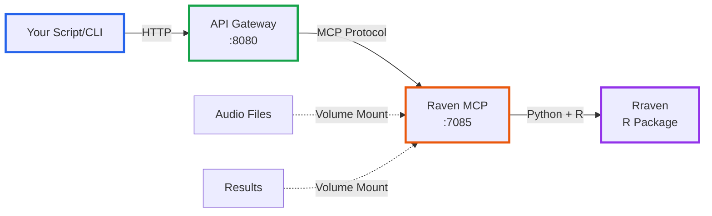

# MCP Integration (Advanced Users)

This directory contains **optional** Model Context Protocol (MCP) services for advanced workflows. Most users should use the **Jupyter notebook** instead - it's simpler and doesn't require Docker.

## What is This?

The MCP integration provides:
- **Docker-based Raven conversion service**
- **HTTP API** for programmatic access
- **R/Rraven integration** for advanced acoustic measurements
- **Batch processing** via command-line or API calls

## When to Use MCP Integration

✅ **Use MCP if you:**
- Need to integrate Praven Pro into existing pipelines
- Want HTTP API endpoints for automation
- Need R/Rraven advanced measurements
- Are processing 100+ files programmatically
- Want to run on remote servers

❌ **Use Jupyter notebook instead if you:**
- Are analyzing <100 files
- Prefer interactive analysis
- Don't need API integration
- Want a simpler setup

## Quick Start

### Option 1: Automated Setup (Recommended)

Run the setup script to automatically check dependencies and start services:

```bash
cd mcp-integration
bash setup.sh
```

The script will:
- ✅ Verify Docker and Docker Compose are installed
- ✅ Create required directories
- ✅ Build Docker images
- ✅ Start services
- ✅ Test API endpoints
- ✅ Show next steps

### Option 2: Manual Setup

**1. Prerequisites:**
- **Docker** and **Docker Compose** installed
- **8GB RAM** minimum
- **10GB disk space** for Docker images

**2. Start services:**
```bash
cd mcp-integration
docker compose up -d
```

This starts:
- **Raven MCP** (port 7085) - Core conversion service
- **API Gateway** (port 8080) - HTTP REST API

**3. Test installation:**
```bash
# Check services are running
bash examples/check_health.sh

# Or manually:
curl http://localhost:8080/health
# Expected output: {"ok": true, "service": "praven-api-gateway"}
```

## Usage Examples

**📁 See [`examples/`](examples/) directory for ready-to-run Python and shell scripts!**

The examples below show raw API calls. For easier usage, see:
- `examples/export_single_file.py` - Export one file
- `examples/batch_export.py` - Export all files
- `examples/workflow_example.py` - Complete workflow guide
- `examples/check_health.sh` - Verify services

### Example 1: Export Detection CSV to Raven

```bash
curl -X POST http://localhost:8080/raven/export \
  -H "Content-Type: application/json" \
  -d '{
    "detections_csv": "/workspace/shared/results/csvs/recording_001_detections.csv",
    "output_path": "/workspace/shared/results/raven_tables/recording_001_raven.txt",
    "audio_file": "recording_001.wav",
    "audio_path": "/workspace/shared/audio/recording_001.wav",
    "default_low_freq": 500.0,
    "default_high_freq": 8000.0
  }'
```

### Example 2: Batch Export All Detections

```bash
curl -X POST http://localhost:8080/raven/export_batch \
  -H "Content-Type: application/json" \
  -d '{
    "detections_dir": "/workspace/shared/results/csvs",
    "output_dir": "/workspace/shared/results/raven_tables",
    "audio_dir": "/workspace/shared/audio",
    "default_low_freq": 500.0,
    "default_high_freq": 8000.0
  }'
```

### Example 3: Import Raven Table Back to CSV

```bash
curl -X POST http://localhost:8080/raven/import \
  -H "Content-Type: application/json" \
  -d '{
    "raven_table_path": "/workspace/shared/results/raven_tables/annotated_raven.txt",
    "output_csv": "/workspace/shared/results/csvs/annotated_imported.csv"
  }'
```

## Python Integration

Use the API from Python scripts:

```python
import requests

# Export to Raven
response = requests.post(
    "http://localhost:8080/raven/export",
    json={
        "detections_csv": "/workspace/shared/results/csvs/recording_001_detections.csv",
        "output_path": "/workspace/shared/results/raven_tables/recording_001_raven.txt",
        "audio_file": "recording_001.wav",
        "audio_path": "/workspace/shared/audio/recording_001.wav",
        "default_low_freq": 500.0,
        "default_high_freq": 8000.0
    }
)

print(response.json())
```

## Architecture



## Volume Mounts

The Docker services mount your project directories:

| Host Path | Container Path | Purpose |
|-----------|---------------|---------|
| `../audio_files` | `/workspace/shared/audio` | Audio files (read-only) |
| `../results` | `/workspace/shared/results` | All outputs (read-write) |

## Advanced: R/Rraven Measurements

The Raven MCP service includes R runtime with Rraven package for advanced measurements:

```bash
# Direct MCP call (port 7085)
curl -X POST http://localhost:7085/run/raven_measurements_rraven \
  -H "Content-Type: application/json" \
  -d '{
    "raven_table_path": "/workspace/shared/results/raven_tables/recording_001_raven.txt",
    "audio_file": "/workspace/shared/audio/recording_001.wav",
    "measurements": ["freq", "time", "energy"],
    "output_csv": "/workspace/shared/results/measurements/recording_001_measurements.csv"
  }'
```

This provides advanced acoustic features from the R bioacoustics ecosystem.

## Stopping Services

```bash
docker compose down
```

To also remove volumes:
```bash
docker compose down -v
```

## Troubleshooting

### Port Already in Use

If ports 7085 or 8080 are in use, edit `docker-compose.yml`:

```yaml
ports:
  - "8081:8080"  # Use port 8081 instead
```

### Permission Denied on Results

```bash
# Fix permissions
chmod -R 777 ../results
```

### Service Won't Start

```bash
# Check logs
docker compose logs raven-mcp

# Rebuild
docker compose build --no-cache
docker compose up -d
```

## Comparison: Jupyter vs MCP

| Feature | Jupyter Notebook | MCP Integration |
|---------|-----------------|-----------------|
| **Setup** | pip install | Docker required |
| **Complexity** | Simple | Advanced |
| **Interactive** | Yes ✓ | No |
| **API Access** | No | Yes ✓ |
| **R/Rraven** | No | Yes ✓ |
| **Best For** | Most users | Automation/pipelines |

## More Information

- **Raven MCP Server**: See `raven-mcp/README.md` for tool documentation
- **Main Project**: See main README.md for Jupyter notebook workflow
- **MCP Protocol**: https://github.com/anthropics/mcp

## Support

For MCP-specific issues, open an issue on GitHub with the `mcp` label.

For general Praven Pro questions, use the main README documentation.
